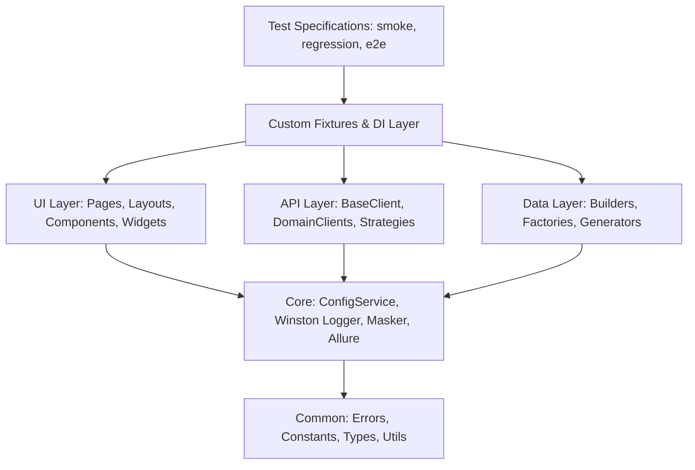

# Enterprise Playwright + TypeScript Architecture Guide

## 1. Executive Summary & Vision

This framework provides an enterprise-grade, application-agnostic end-to-end automation solution designed to validate modern web applications (React, Angular, Vue, Next.js, Nuxt.js, ASP.NET, Java, Python, and legacy micro-frontends) as well as REST APIs and contract schemas.

The architecture strictly decouples:

- **Test Intent**: What business scenarios are being validated (`tests/`).
- **Page & Component Abstractions**: How the UI elements and interactions are structured (`src/ui/`).
- **Network & Protocol Abstractions**: How HTTP calls, headers, and authentication are executed (`src/api/`).
- **Data Modeling**: How test entities, fixtures, and factories are generated (`src/data/`).
- **Infrastructure & Cross-Cutting Concerns**: Logging, configuration, reporting, and security (`src/core/`, `src/common/`).

---

## 2. Enterprise Design Principles in Practice

### 2.1 SOLID Principles

| Principle                     | Framework Implementation                                                                                                                                | Practical Code Reference                                                                                                                                                                                                                                                              |
| :---------------------------- | :------------------------------------------------------------------------------------------------------------------------------------------------------ | :------------------------------------------------------------------------------------------------------------------------------------------------------------------------------------------------------------------------------------------------------------------------------------ |
| **S - Single Responsibility** | Components and classes perform one job. `LoginPage` handles login interactions; `TableComponent` inspects tabular data; `DataMasker` handles redaction. | [`LoginPage`](file:///home/iv-layhort/Documents/plawright-automation-framework/src/ui/pages/login.page.ts), [`TableComponent`](file:///home/iv-layhort/Documents/plawright-automation-framework/src/ui/components/table.component.ts)                                                 |
| **O - Open / Closed**         | Authentication mechanisms are open for extension by implementing `IAuthStrategy` without modifying `BaseApiClient` or test specifications.              | [`IAuthStrategy`](file:///home/iv-layhort/Documents/plawright-automation-framework/src/api/auth/auth-strategy.interface.ts), [`OAuth2ClientCredentialsStrategy`](file:///home/iv-layhort/Documents/plawright-automation-framework/src/api/auth/oauth2-client-credentials.strategy.ts) |
| **L - Liskov Substitution**   | Any `BasePage` extension or `IAuthStrategy` implementation can be substituted anywhere its abstraction is expected without breaking caller invariants.  | `BasePage` and `IAuthStrategy` implementations                                                                                                                                                                                                                                        |
| **I - Interface Segregation** | Fine-grained interfaces ensure consumers only depend on methods they need (e.g. `IAuthStrategy`, `UserModel`, `UserCredentials`).                       | [`src/common/types/index.ts`](file:///home/iv-layhort/Documents/plawright-automation-framework/src/common/types/index.ts)                                                                                                                                                             |
| **D - Dependency Inversion**  | High-level test specs depend on custom fixtures (`apiClient`, `loginPage`, `envConfig`), not directly on concrete instantiations or disk `.env` paths.  | [`test.fixture.ts`](file:///home/iv-layhort/Documents/plawright-automation-framework/src/core/fixtures/test.fixture.ts)                                                                                                                                                               |

### 2.2 Composition over Inheritance

Traditional automation frameworks suffer from bloated base classes (e.g., `BasePage` containing hundreds of helper methods for headers, sidebars, alerts, tables, and footers).

In this framework:

- `BasePage` provides ONLY fundamental page mechanics (locator auto-wait, resilient clicks, screenshots, logging).
- Complex pages compose smaller layout and widget objects:
  ```typescript
  export class InventoryPage extends BasePage {
    public readonly header: HeaderLayout;
    public readonly sidebar: SidebarLayout;
    public readonly footer: FooterLayout;
    public readonly sortDropdown: DropdownWidget;

    constructor(page: Page, logger: ScopedLogger) {
      super(page, logger);
      this.header = new HeaderLayout(page);
      this.sidebar = new SidebarLayout(page);
      this.footer = new FooterLayout(page);
      this.sortDropdown = new DropdownWidget(page, page.locator('.product_sort_container'));
    }
  }
  ```

### 2.3 Clean Architecture Layers



---

## 3. Configuration & Multi-Environment Strategy

Configuration is powered by a singleton `ConfigService` that validates environment variables against a strict **Zod** schema (`EnvSchema`) at framework bootstrap:

1. Target environment is selected via `TEST_ENV=<local|dev|qa|uat|staging|prod>`.
2. The service loads `configs/.env.${TEST_ENV}` with fallback to `configs/.env.local`.
3. If any mandatory variable is missing or malformed, the framework fails immediately with explicit diagnostic output.

---

## 4. Centralized Logging & Observability

- **Correlation IDs**: Each test execution and each API call receives a unique UUID (`correlationId`), traced across log entries and attached to HTTP request headers (`X-Correlation-ID`).
- **Credential Masking**: `DataMasker` recursively redacts secrets (passwords, tokens, cookies, auth headers) before sending logs to Console or rotating log files (`logs/framework-YYYY-MM-DD.log`).
- **Reporting Sync**: All actions automatically log to the active Playwright HTML report and Allure step tree.

---

## 5. Extensibility Guide

### Adding a New Page Object

1. Create page class in `src/ui/pages/<name>.page.ts` extending `BasePage`.
2. Compose any existing layouts (`HeaderLayout`, `FooterLayout`) or widgets (`DropdownWidget`).
3. Add the page to `src/core/fixtures/test.fixture.ts` for zero-boilerplate injection into specs.

### Adding a New API Domain Client

1. Define the Zod response and request schemas in `src/api/schemas/<domain>.schema.ts`.
2. Create client in `src/api/domain-clients/<domain>-api.client.ts` taking `BaseApiClient`.
3. Expose typed helper methods returning `ApiResponse<T>`.
