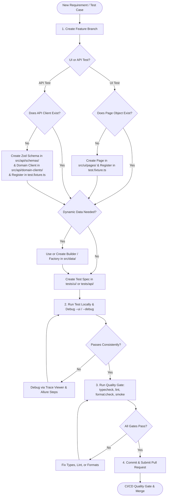

# New QA Engineer Onboarding: Test Creation User Flow

Welcome to the Enterprise Test Automation Framework! This guide outlines the end-to-end user flow for a QA Engineer to plan, implement, debug, verify, and commit a new test specification (UI or API).

---

## 1. High-Level Test Creation Lifecycle



---

## 2. Step-by-Step User Flow

### Phase 1: Environment & Branch Preparation

1. **Pull Latest Main Branch**:
   ```bash
   git checkout main
   git pull origin main
   ```
2. **Create a Feature Branch** following the branch naming standard:
   ```bash
   git checkout -b feature/QE-<JIRA-ID>-<short-description>
   # Example: git checkout -b feature/QE-105-user-registration-test
   ```
3. **Set Up Local Environment Configuration**:
   Ensure `configs/.env.local` exists (copied from `configs/.env.example`).
   ```bash
   cp configs/.env.example configs/.env.local
   ```
4. **Sanity Check Repository Health**:
   ```bash
   npm run typecheck
   npm run lint
   ```

---

### Phase 2: Determine Test Scope & Architectural Components

Before writing test steps, identify what framework components are needed:

| Question                                                    | If YES                                         | If NO                                                                                  |
| :---------------------------------------------------------- | :--------------------------------------------- | :------------------------------------------------------------------------------------- |
| **Is it a UI Test?**                                        | Proceed to UI flow                             | Proceed to API flow                                                                    |
| **Does the target Page Object exist in `src/ui/pages/`?**   | Inject page fixture directly into your test    | Create new Page Object extending `BasePage` and register it in `test.fixture.ts`       |
| **Does the test require dynamic entities (users, orders)?** | Use existing Builders/Factories in `src/data/` | Create a new Builder using `@faker-js/faker` & `uuid` to avoid parallel collisions     |
| **Does the API client exist in `src/api/domain-clients/`?** | Inject client fixture directly into your test  | Define Zod schema in `src/api/schemas/` and Domain Client in `src/api/domain-clients/` |

---

### Phase 3A: Creating a UI Test Flow

#### Step 1: Create or Extend Page Objects (if needed)

If testing a new page (e.g., `src/ui/pages/user-profile.page.ts`):

```typescript
// src/ui/pages/user-profile.page.ts
import { Page, Locator } from '@playwright/test';
import { BasePage } from '../base/base.page';
import { HeaderLayout } from '../layouts/header.layout';
import { ScopedLogger } from '../../core/logging';

export class UserProfilePage extends BasePage {
  public readonly header: HeaderLayout;
  private readonly editProfileButton: Locator;
  private readonly bioTextarea: Locator;
  private readonly saveButton: Locator;
  private readonly successAlert: Locator;

  constructor(page: Page, logger: ScopedLogger) {
    super(page, logger);
    this.header = new HeaderLayout(page);
    // Use resilient, accessible selectors (role, data-test, or unique ID)
    this.editProfileButton = page.getByRole('button', { name: 'Edit Profile' });
    this.bioTextarea = page.locator('[data-test="bio-input"]');
    this.saveButton = page.getByRole('button', { name: 'Save' });
    this.successAlert = page.locator('[data-test="profile-saved-banner"]');
  }

  public async updateBio(bioText: string): Promise<void> {
    await this.clickElement(this.editProfileButton, 'Edit Profile Button');
    await this.fillInput(this.bioTextarea, bioText, 'Bio Input Field');
    await this.clickElement(this.saveButton, 'Save Button');
  }

  public async getSuccessMessage(): Promise<string> {
    return await this.getElementText(this.successAlert, 'Profile Saved Banner');
  }
}
```

#### Step 2: Register in Fixture (Dependency Injection)

Register the new page in `src/core/fixtures/test.fixture.ts`:

```typescript
// 1. Add to EnterpriseFixtures interface
export interface EnterpriseFixtures {
  // ... existing fixtures
  userProfilePage: UserProfilePage;
}

// 2. Add provider to test.extend
export const test = base.extend<EnterpriseFixtures>({
  // ... existing fixtures
  userProfilePage: async ({ page, testLogger }, use) => {
    await use(new UserProfilePage(page, testLogger));
  },
});
```

#### Step 3: Write the UI Test Specification

Create spec file under `tests/ui/<feature>/<name>.<type>.spec.ts`:

- **Naming format**: `<feature-name>.<smoke|regression|e2e>.spec.ts`
- **Example**: `tests/ui/profile/user-profile.regression.spec.ts`

```typescript
import { test, expect } from '../../../src/core/fixtures';
import { ReportHelper } from '../../../src/core/reporting';
import { UserFactory } from '../../../src/data/factories/user.factory';

test.describe('User Profile Management Suite', { tag: ['@ui', '@regression', '@profile'] }, () => {
  test.beforeEach(async () => {
    ReportHelper.setAllureMetadata({
      epic: 'User Management',
      feature: 'Profile Customization',
      story: 'Update Bio',
      severity: 'normal',
    });
  });

  test('TC-PROF-001: Update user biography successfully', async ({
    authenticatedPage: _page, // Automatically logs in using standard user
    userProfilePage,
    testLogger,
  }) => {
    testLogger.info('Starting TC-PROF-001: Bio update verification');

    const dynamicUser = UserFactory.createStandardUser();
    const updatedBio = `Quality Architect - Passionate about automation. Id: ${dynamicUser.id}`;

    await userProfilePage.updateBio(updatedBio);

    const message = await userProfilePage.getSuccessMessage();
    expect(message).toContain('Profile updated successfully');

    testLogger.info('TC-PROF-001 completed successfully');
  });
});
```

---

### Phase 3B: Creating an API Test Flow

#### Step 1: Define the Zod Schema & Domain Client (if needed)

1. Create schema in `src/api/schemas/item.schema.ts`:

   ```typescript
   import { z } from 'zod';

   export const ItemSchema = z.object({
     id: z.string(),
     title: z.string(),
     price: z.number().positive(),
     inStock: z.boolean(),
   });

   export type ItemResponse = z.infer<typeof ItemSchema>;
   ```

2. Create domain client in `src/api/domain-clients/item-api.client.ts`:

   ```typescript
   import { BaseApiClient, ApiResponse } from '../client/base-api.client';
   import { ItemResponse } from '../schemas/item.schema';

   export class ItemApiClient {
     constructor(private readonly client: BaseApiClient) {}

     public async getItemById(id: string): Promise<ApiResponse<ItemResponse>> {
       return await this.client.get<ItemResponse>(`/api/items/${id}`);
     }
   }
   ```

3. Register `itemApiClient` in `src/core/fixtures/test.fixture.ts`.

#### Step 2: Write the API Test Specification

Create spec file under `tests/api/<feature>/<name>.<type>.spec.ts`:

- **Example**: `tests/api/items/items.spec.ts`

```typescript
import { test, expect } from '../../../src/core/fixtures';
import { ResponseValidator } from '../../../src/api/response-validators/response.validator';
import { ItemSchema } from '../../../src/api/schemas/item.schema';
import { HttpStatus } from '../../../src/common/constants/http-status.constants';
import { ReportHelper } from '../../../src/core/reporting';

test.describe(
  'Items API - Contract & Data Verification',
  { tag: ['@api', '@smoke', '@items'] },
  () => {
    test.beforeEach(async () => {
      ReportHelper.setAllureMetadata({
        epic: 'Catalog Service',
        feature: 'Item Ingestion',
        severity: 'critical',
      });
    });

    test('TC-API-ITEM-001: Fetch item and validate schema contract', async ({
      itemApiClient,
      testLogger,
    }) => {
      testLogger.info('Calling GET /api/items/item-101');
      const response = await itemApiClient.getItemById('item-101');

      // Fluent validation: status, headers, and SLA response time
      const validator = ResponseValidator.of(response)
        .expectStatus(HttpStatus.OK)
        .expectHeader('content-type')
        .expectResponseTimeBelow(2000);

      // Runtime schema validation
      const validatedData = validator.validateSchema(ItemSchema);
      expect(validatedData.id).toBe('item-101');
      expect(validatedData.price).toBeGreaterThan(0);
    });
  },
);
```

---

### Phase 4: Local Execution, Debugging & Verification

Never commit untested specs. Run and debug your test using these commands:

1. **Run Only Your Test**:

   ```bash
   npx playwright test tests/ui/profile/user-profile.regression.spec.ts
   ```

2. **Run in Headed Mode (Watch Browser UI)**:

   ```bash
   npx playwright test tests/ui/profile/user-profile.regression.spec.ts --headed
   ```

3. **Interactive Playwright UI Mode (Recommended for Development)**:

   ```bash
   npx playwright test tests/ui/profile/user-profile.regression.spec.ts --ui
   ```

4. **Debug Mode (Step-by-Step Execution & DOM Inspection)**:

   ```bash
   npx playwright test tests/ui/profile/user-profile.regression.spec.ts --debug
   ```

5. **Inspect Execution Traces & Screenshots**:
   If a test fails or is retried, open the Playwright HTML report:

   ```bash
   npm run report:html
   ```

6. **Verify Allure Report Generation**:
   ```bash
   npm run report:allure:generate
   npm run report:allure:open
   ```

---

## 3. Mandatory Engineering Rules & Best Practices

| Rule            | ✅ DO                                                                         | ❌ DO NOT                                                                           |
| :-------------- | :---------------------------------------------------------------------------- | :---------------------------------------------------------------------------------- |
| **Imports**     | `import { test, expect } from '../../../src/core/fixtures';`                  | `import { test, expect } from '@playwright/test';` (misses custom fixtures)         |
| **Assertions**  | `await expect(locator).toBeVisible();` (auto-retrying)                        | `await WaitUtils.sleep(5000);` or `expect(await locator.isVisible()).toBe(true);`   |
| **Test Data**   | `const user = UserFactory.createStandardUser();` (dynamic UUID/timestamp)     | `const email = 'qa_test@company.com';` (causes race conditions in parallel workers) |
| **Locators**    | Use `data-test`, `role`, or scoped user-facing anchors                        | Brittle absolute XPaths like `/html/body/div[2]/div/form/button`                    |
| **Credentials** | `envConfig.STANDARD_PASSWORD` or `SecretManager`                              | Hardcoded passwords, API keys, or bearer tokens in code                             |
| **Logging**     | `testLogger.info('Action description');`                                      | `console.log('debug here')` (unmasked and not formatted)                            |
| **Tags**        | Every test must include tags: `{ tag: ['@ui', '@regression', '@<feature>'] }` | Tests without tags (breaks selective CI runs)                                       |

---

## 4. Pre-Commit Quality Gate & Pull Request Checklist

Before submitting your PR, ensure all 4 local gates pass with 0 errors:

```bash
# 1. Verify TypeScript compiles with strict types
npm run typecheck

# 2. Check for ESLint warnings or anti-patterns
npm run lint

# 3. Verify Prettier formatting
npm run format:check
# (Run 'npm run format' if formatting needs auto-fixing)

# 4. Run Smoke Suite to ensure no regressions
npm run test:smoke
```

### Git Commit & PR Submission:

```bash
git add .
git commit -m "feat(profile): TC-PROF-001 user bio update regression test"
# Note: Husky pre-commit hook automatically verifies linting and formatting
git push origin feature/QE-105-user-registration-test
```

### Pull Request Description Template:

- **JIRA Ticket**: `QE-105`
- **Scope**: Added UI regression test for User Bio update flow.
- **Components Modified/Added**:
  - `src/ui/pages/user-profile.page.ts` (New Page Object)
  - `src/core/fixtures/test.fixture.ts` (Injected `userProfilePage`)
  - `tests/ui/profile/user-profile.regression.spec.ts` (Spec)
- **Local Verification**:
  - `npm run typecheck` passed (0 errors)
  - `npm run lint` passed (0 errors)
  - Ran 3 consecutive local passes in Chromium and Firefox.
